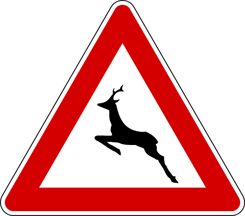
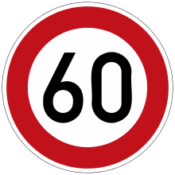
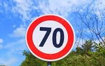
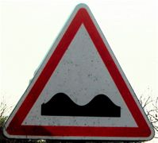
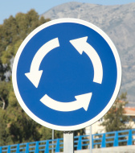
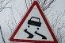
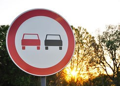

#**Traffic Sign Recognition** 

##Deep learning classification


---

**Build a Traffic Sign Recognition Project**

The goals / steps of this project are the following:
* Load the data set.
* Explore, summarize and visualize the data set
* Design, train and test a model architecture
* Use the model to make predictions on new images
* Analyze the softmax probabilities of the new images
* Summarize the results with a written report


[//]: # (Image References)


---

Please find the code to my project in the following link: [project code](https://github.com/AShabayek/SDnanodegree/blob/master/CarND-Traffic-classifier/Traffic_Sign_Classifier.ipynb)

###Data Set Summary & Exploration

####1.Loading the data

#####Data summary
```python 
import numpy as np
n_train = y_train.shape[0]
n_validation = y_valid.shape[0]
n_test = y_test.shape[0]
image_shape = X_train.shape[0]
n_classes = np.unique(y_train).shape[0]
print("Number of training examples =", n_train)
print("Number of testing examples =", n_test)
print("Image data shape =", image_shape)
print("Number of classes =", n_classes)
```
>Number of training examples = 34799
Number of testing examples = 12630
Image data shape = 34799
Number of classes = 43

#####Different class frequencies represented by histogram
![alt text][image1]

###2. Data preprocessing
In the data preprocessing section random sorting of data is applied to prevent biased training as well as normalization.
first after directly loading the data normalization is applied in the following manner:
```python
X_train = ( (X_train / 255) * 0.9) + 0.1
X_test = ( (X_test / 255) * 0.9) + 0.1
X_valid = ( (X_valid / 255) * 0.9) + 0.1
```

```python
from sklearn.utils import shuffle
from sklearn.model_selection import train_test_split
np.random.seed(99)
X_train, y_train = shuffle(X_train, y_train)
X_train, X_validation, y_train, y_validation = train_test_split(X_train, y_train, test_size=0.2, random_state=42)
```

###Design and Test a Model Architecture

####1. Inputs to the network

As previously mentioned input to the neural network is the normalized images shuffled in a random manner all improve the training process to yield better results.
Normalization of the data yielded better performance of the network during and after training, according to my understanding its due to have a more consitent range of the pixel data so that exteme values dont cause uneeded bias while training.
shuffling data afterwards yields better training of the network as it is now more genralized to the different classes.


####2. Network architecture.
I both tried the standard Lenet network and also my own modified Lenet in which I added the Inception concept in the convloutional layer making it a step similar to the VGG architecture aswell as increased the flat layers at the end. 

My final model consisted of the following layers:

| Layer         		|     Description	        					| 
|:---------------------:|:---------------------------------------------:| 
| Input         		| 32x32x3 RGB image   							| 
| 1-Inc.Convolution 3x3 | 1x1 stride, valid padding, outputs 30x30x24 	|
| RELU					|												|
| Max pooling	      	| 1x1 stride,  outputs 15x15x24 				|
| 1-Inc.Convolution 3x3	|1x1 stride, valid padding, outputs 13x13x28.   |
| RELU					|												|
| Max pooling	      	| 1x1 stride,  outputs 6x6x28 				    |
| 2-Inc.Convolution 3x3 | 1x1 stride, valid padding, outputs 30x30x24 	|
| RELU					|												|
| Max pooling	      	| 1x1 stride,  outputs 15x15x24 				|
| 2-Inc.Convolution 3x3	|1x1 stride, valid padding, outputs 13x13x28.   |
| RELU					|												|
| Max pooling	      	| 1x1 stride,  outputs 6x6x28 				    |
|Fully connected(merge of Inc. 1 & 2)|                                  |
| Flatten & Input       | 1800
| Fully connected		| outputs : 700       							|
| Fully connected       | output  : 400                                 |
| Fully connected       | output  : 120                                 |
| Fully connected       | output  : 84                                  |
| Fully connected       | output  : 43                                  |
 


####3. Network Training.

In training I used 24 Epochs as adding the inception layers and the flat layers at the end of the network adds complexity and thus demands more training and tuning, 24 was a sufficient number of epochs to near saturation. Learning rate was 0.0005

####4. Results.

My final model results were:
* 1.0
* validation set accuracy of ? 
* 0.919

If an iterative approach was chosen:
* What was the first architecture that was tried and why was it chosen?
* What were some problems with the initial architecture?
* How was the architecture adjusted and why was it adjusted? Typical adjustments could include choosing a different model architecture, adding or taking away layers (pooling, dropout, convolution, etc), using an activation function or changing the activation function. One common justification for adjusting an architecture would be due to overfitting or underfitting. A high accuracy on the training set but low accuracy on the validation set indicates over fitting; a low accuracy on both sets indicates under fitting.
* Which parameters were tuned? How were they adjusted and why?
* What are some of the important design choices and why were they chosen? For example, why might a convolution layer work well with this problem? How might a dropout layer help with creating a successful model?

If a well known architecture was chosen:
* What architecture was chosen?
* Why did you believe it would be relevant to the traffic sign application?
* How does the final model's accuracy on the training, validation and test set provide evidence that the model is working well?
 

###Test a Model on New Images

####1. Choose five German traffic signs found on the web and provide them in the report. For each image, discuss what quality or qualities might be difficult to classify.

Here are five German traffic signs that I found on the web:

  
 
  
  
  
some will be difficult to classify due the features being of center and having alot of background noise in them.

####2.Model's performance to new inputs.

Here are the results of the prediction:

| Image			        |     Prediction	        |      Probability | Output	        					|
|:---------------------:|:---------------------------------------------:| 
|ID:3(60speedlimit)      		| Stop sign   								| 
|ID:4 (70speed)     			| U-turn 									|
|ID:31 (animalcrossing)			| Yield									|
|ID:22 (bumpyroad)	      		| Bumpy Road					 		|
|ID:17 (noentry)			    | Slippery Road      						|
|ID:9 (nopassing)      		    | Stop sign   								| 
|ID:38 (passright)     			| U-turn 									|
|ID:25 (roadworks)				| Yield									|
|ID:40roundabout	      		| Bumpy Road					 			|
|ID:23 (Slippery Road)			| Slippery Road      					    |


The model was able to correctly guess 4 of the 5 traffic signs, which gives an accuracy of 80%. This compares favorably to the accuracy on the test set of ...

####3. Describe how certain the model is when predicting on each of the five new images by looking at the softmax probabilities for each prediction. Provide the top 5 softmax probabilities for each image along with the sign type of each probability. (OPTIONAL: as described in the "Stand Out Suggestions" part of the rubric, visualizations can also be provided such as bar charts)

The code for making predictions on my final model is located in the 11th cell of the Ipython notebook.

For the first image, the model is relatively sure that this is a stop sign (probability of 0.6), and the image does contain a stop sign. The top five soft max probabilities were

| Probability         	|     Prediction	        					| 
|:---------------------:|:---------------------------------------------:| 
| .60         			| Stop sign   									| 
| .20     				| U-turn 										|
| .05					| Yield											|
| .04	      			| Bumpy Road					 				|
| .01				    | Slippery Road      							|


For the second image ... 


